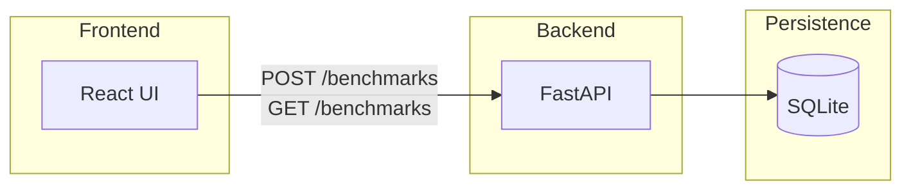

# Архитектура

## Назначение

Клиентская часть (React) запускает рендер шаблонов с разными движками, замеряет время и отправляет результат на сервер. Сервер (FastAPI) сохраняет записи в SQLite и позволяет получить историю измерений для анализа и графиков.

## Компоненты

## Поток данных

1. Пользователь выбирает шаблонизатор и параметры в UI.
2. UI выполняет рендер и измеряет `render_time_ms`.
3. UI отправляет `POST /benchmarks` с полями `template_engine`, `render_time_ms`, опционально `payload`.
4. Для отображения истории UI вызывает `GET /benchmarks` (с опциональной фильтрацией и пагинацией).

## Технические детали backend

- **ORM**: SQLAlchemy 2 (sync); таблица создаётся при старте приложения (`create_all`).
- **Валидация**: Pydantic v2 на входе и выходе эндпоинтов.
- **Документация API**: автоматически `/docs` и `/redoc`.
