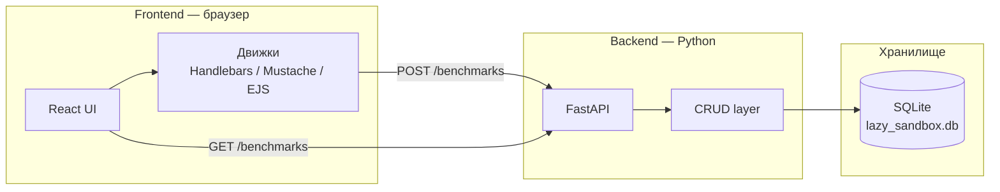

# Архитектура

## Назначение

Клиентская часть (React) запускает рендер шаблонов с разными движками прямо в браузере,
замеряет время и отправляет результат на сервер. Сервер (FastAPI) сохраняет записи
в SQLite и позволяет получить историю измерений.

## Компоненты высокого уровня



## Поток данных

1. Пользователь выбирает движок и вводит шаблон + JSON в UI.
2. При нажатии «Рендер» `App.tsx` вызывает `renderTemplate()` — рендер выполняется
   в браузере с замером времени через `performance.now()`.
3. Результат и `render_time_ms` отображаются в `ResultView`.
4. `saveBenchmark()` отправляет `POST /benchmarks` с полями `template_engine`,
   `render_time_ms`, `payload`.
5. После успешного сохранения `historyRefreshKey` инкрементируется, `BenchmarkHistory`
   заново вызывает `GET /benchmarks` и обновляет таблицу.

## Технические детали backend

| Аспект | Реализация |
|--------|------------|
| ORM | SQLAlchemy 2 (синхронный) |
| Создание схемы | `Base.metadata.create_all()` при старте (`lifespan`) |
| Валидация | Pydantic v2 на входе и выходе всех эндпоинтов |
| CORS | `CORSMiddleware`; origins настраиваются через `CORS_ORIGINS` в `.env` |
| Документация | Swagger UI на `/docs`, ReDoc на `/redoc` |
| Тесты | pytest + `TestClient` из httpx; изолированная in-memory SQLite |

## Технические детали frontend

| Аспект | Реализация |
|--------|------------|
| Фреймворк | React 19 + TypeScript 6 |
| Сборщик | Vite 8 |
| Рендеринг шаблонов | Handlebars 4, Mustache 4, EJS 5 (NPM-пакеты в браузере) |
| Замер времени | `performance.now()` с точностью 0.0001 мс |
| HTTP-клиент | Нативный `fetch` |
| Конфигурация URL бэкенда | Переменная окружения `VITE_API_BASE_URL` (по умолчанию: тот же origin) |
| Состояние | Хуки `useState` в корневом `App.tsx`; компоненты stateless |
| Доступность | TemplateSelector — WAI-ARIA Listbox, `aria-live` в ResultView |

## Модули и зависимости

```
App.tsx
 ├── TemplateSelector   (чистый UI)
 ├── TemplateInput      (чистый UI)
 ├── DataInput          (чистый UI)
 ├── RenderButton       (чистый UI)
 ├── ResultView         (чистый UI)
 ├── BenchmarkHistory   → benchmarkApi.getBenchmarks()
 └── handleRender()
      ├── templateRenderer.renderTemplate()
      │    └── handlebars / mustache / ejs
      └── benchmarkApi.saveBenchmark()
           └── fetch POST /benchmarks
```
